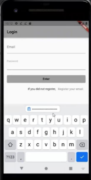
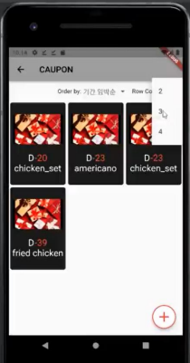

# :iphone: CAUPON
모바일 쿠폰, 종이 쿠폰을 종합하여 관리할 수 있는 기프티폰 앱입니다.

 

# :clipboard:주요 기능
1. 회원가입/로그인 기능
2. 쿠폰 등록(카메라/갤러리 사진 선택 가능)
3. 쿠폰 수정/삭제
4. 쿠폰 정렬
5. 쿠폰 배치 커스텀화

 

# :page_with_curl: 상세 설명

### 1. 회원가입/로그인 기능  

- 앱 첫 화면인 로그인 화면입니다.
- 계정이 없을 경우 Register your email 텍스트 버튼을 클릭하여 계정을 새로 생성합니다. 
- 회원가입이 성공한 경우, 뒤로 가기 버튼을 눌러 로그인을 다시 수행합니다.  

 

### 2. 쿠폰 등록(카메라/갤러리)    

  
 

'+’ 버튼을 누를 시, 쿠폰을 등록할 수 있는 창이 뜨고, 창 내에 이미지를 누를 시 쿠폰을 등록할 수 있는 방법(카메라/갤러리)를 선택할 수 있는 부분이 나옵니다.

 
  

 

등록한 쿠폰 이미지를 선택한 후, 바코드와 유효기간을 인식하도록 영역을 조절하는 화면이 나옵니다. 영역 설정을 완료하면, 버튼에 인식된 쿠폰 유효기간이 표시됩니다. 쿠폰 일자를 변경하고 싶을 시, 버튼을 누르면 날짜를 선택할 수 있는 DatePicker가 나옵니다.  

 
  
   

그 외에 이름과 브랜드를 추가적으로 입력하고 Enter을 누르면 쿠폰이 등록됩니다.

### 3. 쿠폰 수정/삭제/사용완료

 
  
   

- 메인 페이지에 존재하는 쿠폰을 누르면 해당 쿠폰 정보를 담고 있는 페이지가 나옵니다. 
- 쿠폰 정보 페이지에서 이미지를 누를 시, 실제 기프티콘을 사용할 수 있도록 기프티콘 이미지가 크게 보입니다.
- 페이지 내에 수정, 삭제, 사용 완료 버튼이 있다. 수정 버튼을 누를 시 쿠폰의 이름과 유효 기간을 수정할 수 있습니다. 
- 삭제 버튼, 사용 완료 버튼을 눌러 기프티콘을 관리할 수 있습니다.

### 4. 쿠폰 정렬

 
  
  

- 메인 페이지 상단의 dropbox를 통해 쿠폰을 해당 기준에 맞게 정렬 가능합니다. 
- 필터는 ‘전체’, ‘기간 임박 순’, ‘기간 많은 순’, ‘이름’, ‘미사용’, ‘사용완료’가 있습니다.

 
  
  

### 5. 쿠폰 배치 커스텀화

- 메인 페이지 우측 상단의 dropbox를 통해 한 행에서의 쿠폰 개수를 조절할 수 있습니다.
- 2~4개까지 표현할 수 있으며 개수에 따라 기프티콘 크기가 바뀝니다.

 
  
  

# :computer: 기술 스택
 > 프론트 : flutter
 
 > 백엔드 : SpringBoot, mysql, AWS(S3, RDS, EC2), firebase(fire store, ML Kit)
 

